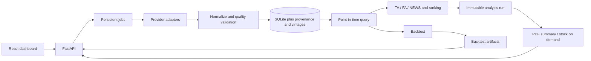

# Kiến trúc và hợp đồng triển khai

## Phân lớp

Hiện đã có config, provider KBS, source-health, schema, API, dashboard, job nền,
cache/PIT, analysis và PDF. Backtest gồm simulator kiểm thử và kiểm tra prerequisites;
chưa có historical score replay/benchmark/walk-forward, nên trả UNAVAILABLE.
Chọn SQLite/SQLAlchemy vì chỉ 5–10 mã và dễ đối soát; React/FastAPI tách biệt để
test API độc lập. Chỉ báo sẽ tự cài bằng pandas/numpy để tránh phụ thuộc TA không
ổn định; phải so với fixture tham chiếu trước khi dùng.

## 15 bảng đã triển khai

| Bảng | Vai trò |
|---|---|
| `stocks` | Mã/ngành; không tự xác nhận thành viên VN30 |
| `source_fetches` | Metadata truy vấn, nguồn, thời điểm, đơn vị, hash |
| `universe_snapshots` | Ngày quan sát/hiệu lực/công bố, độ phủ, verified |
| `universe_members` | Thành phần đầy đủ mỗi snapshot |
| `price_bars` | Raw OHLCV, adjusted close riêng, available_at, điều chỉnh verified |
| `fundamental_values` | Metric theo kỳ, unit gốc/chuẩn, công bố, available_at, revision |
| `news_items` | Tiêu đề/URL/ngày, symbols, dedup, classifier cache; không toàn văn |
| `corporate_actions` | Chia tách/cổ tức, ngày sự kiện/thanh toán, bằng chứng |
| `trading_sessions` | Phiên chính thức, hỗ trợ missing-session và settlement |
| `data_quality_issues` | Mã lỗi/độ nghiêm trọng/symbol/fetch_id |
| `jobs` | Trạng thái, timing, kết quả, mã lỗi có thể giải thích |
| `analysis_runs` | Ngày phân tích/config snapshot/hash/IDs đầu vào |
| `analysis_results` | Điểm nullable, trạng thái, lý do, breakdown |
| `backtest_runs` | Mode/seed/config/data hash/IDs/kết quả/giới hạn |
| `report_artifacts` | PDF liên kết run bất biến, đường dẫn tương đối và file hash |

Foreign keys bật trên mọi connection, SQLite WAL và busy timeout. UTC timezone
được phục hồi khi đọc SQLite; timestamp naive bị từ chối. Giá không dương và
OHLC sai bị chặn ở schema; bản ghi lỗi phải được audit trước khi loại ở data layer.

Giá cập nhật giữ được phiên bản/hash thay vì đè dữ liệu âm thầm. Cần query chọn
vintage nhất quán trước analysis; unique key không thay thế logic incremental.
BCTC đã phân biệt quarter/year và revision. Trước giai đoạn 2 cần Alembic migration
đầu tiên; hiện `create_all` chỉ dùng bootstrap DB mới, không tự nâng schema DB cũ.

## Hợp đồng API hiện tại

| Method | Route | Kết quả / điều kiện |
|---|---|---|
| GET | `/api/health` | Source-health, schema/freshness và job timing |
| GET | `/api/universe?date=` | Snapshot tại ngày + candidates, cảnh báo coverage |
| POST | `/api/universe/select` | 5–10 mã, xác minh snapshot; không hợp lệ trả 422 |
| POST | `/api/data/refresh` | 202 + job_id; không chặn HTTP chờ nguồn |
| GET | `/api/jobs/{id}` | Pending/running/succeeded/failed + timing và error_code |
| POST | `/api/analysis/run` | 202 + job_id, as_of_date rõ ràng |
| GET | `/api/ranking?as_of=` | Main/secondary, reasons, version, analysis_run_id |
| GET | `/api/stocks/{symbol}` | Chuỗi giá/chỉ báo/FA/tin/breakdown/provenance |
| POST | `/api/reports/summary` | Gắn analysis_run_id, PDF tổng hợp |
| POST | `/api/reports/stock/{symbol}` | PDF chi tiết theo yêu cầu |
| GET | `/api/reports/{id}/download` | File whitelist trong reports_out, không nhận path tùy ý |
| POST | `/api/backtest/run` | 202 + job_id, kiểm tra mode/data prerequisites |
| GET | `/api/backtest/{id}` | Metrics/curves/trades/config/hash/limitations |
| GET | `/api/config/scoring` | YAML đã validate + version/hash |
| GET | `/api/reports` | Lịch sử PDF, bổ sung để UI đọc lịch sử |
| GET | `/api/data/quality` | Quality issues, bổ sung cho trang Hệ thống |

Pydantic response schemas, OpenAPI, 404 khi không có run/symbol/report; 409 khi
nguồn/snapshot chưa đủ; lỗi provider có mã cụ thể, không trả raw exception.
Worker đầu tiên chạy single-process vì SQLite, có trạng thái job bền vững và khóa
chống hai job refresh cùng mã. Khi restart phải đánh dấu job dở dang/interrupted.

## Cổng kiểm thử theo giai đoạn

Data layer: fixtures từng schema, incremental không tải trùng, quality issues,
snapshot date validity. Analysis: chỉ báo/chuẩn hóa/missing/no reweight/ranking.
API: integration route/jobs/error. PDF: render/font/nguồn/DB snapshot concordance.
UI: build TypeScript và workflow thật. Backtest: cố tình chèn dữ liệu tương lai,
revision, lô, chi phí, settlement, độ thanh khoản; kết quả lặp lại cùng hash/seed.
Cuối cùng: end-to-end chọn mã → refresh → analyze → ranking → summary/stock PDF.
